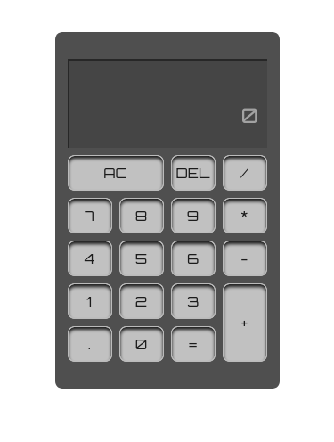

# calculator
This is a simple calculator which is useful for basic mathematical operations.

  

This calculator project is from Odin's Project Curriculum which helps a student to showcase their knowledge of the fundamentals of the javascript programming language and to furthermore help them have a better understanding of the language.

## Built With

- HTML
- CSS
- JAVASCRIPT

## Live Demo Link
[Live Demo Link](https://zieeco.github.io/calculator/)

## Getting Started

To get a local copy up and running:

1. Clone this repository or download the Zip folder:

**``https://github.com/zieeco/calculator.git``**

1. Navigate to the location of the folder in your machine:

**``you@your-Pc-name:~$ cd <folder>``**

## Author

👤 **Isaac Samuel**

- Github: [@zieeco](https://github.com/zieeco)

- LinkedIn: [Isaac Imaobong Samuel](https://www.linkedin.com/in/isaac-imaobong-samuel-a4849b1b8/)

## Credits

Lesson from [The Odin Project JavaScript Fundamentals](https://www.theodinproject.com/paths/foundations/courses/foundations/lessons/calculator)

## Contributing

Contributions, issues, and feature requests are welcome!

## Show your support

Give a ⭐️ if you like this project and how we manage to build it!

## 📝 License

This project is [MIT](./MIT.md) licensed